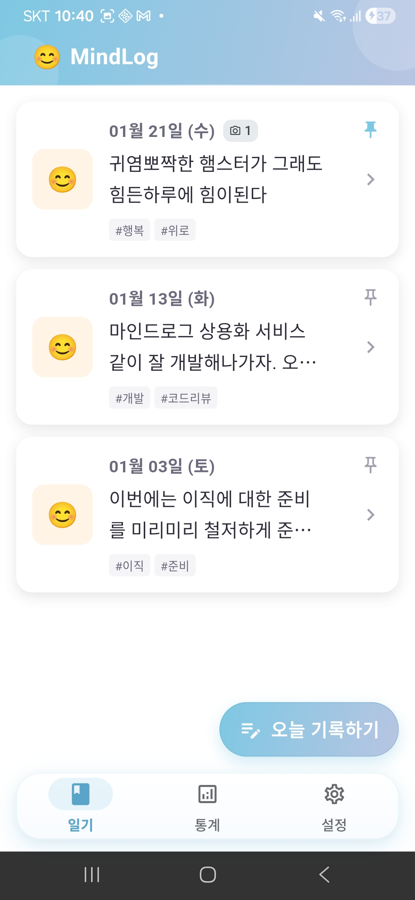
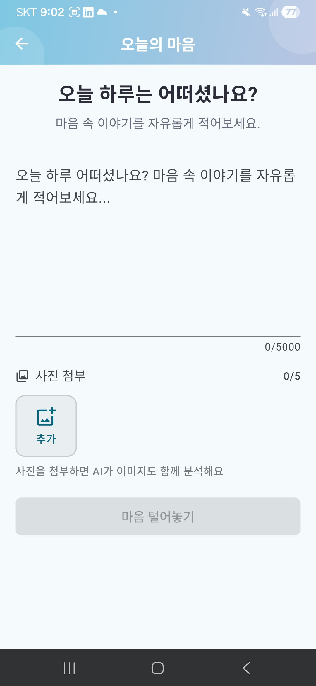
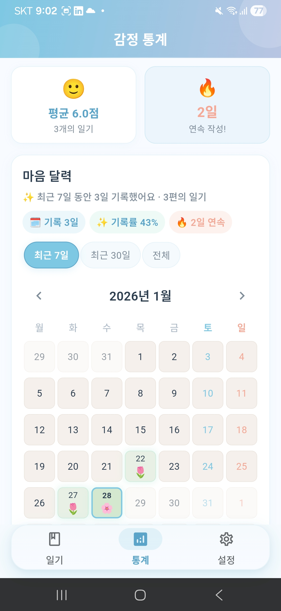
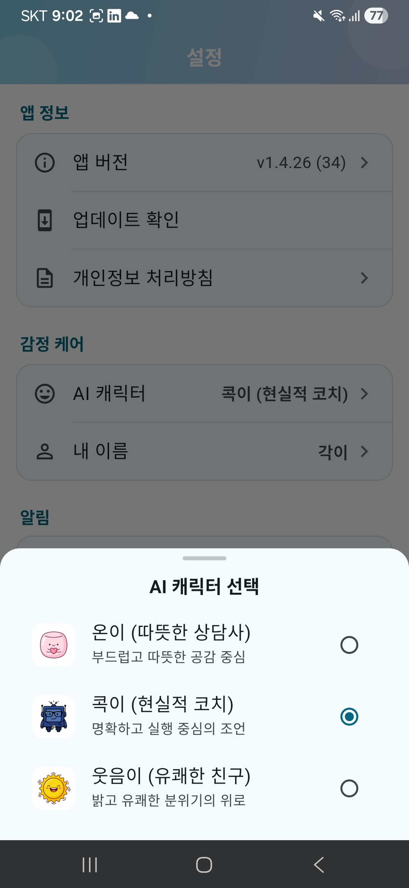

<p align="center">
  <a href="README.md">🇺🇸 English</a>
</p>

<p align="center">
  
</p>

<h1 align="center">MindLog (마음 로그)</h1>
<p align="center">
  <strong>AI가 당신의 마음을 읽고, 오늘 하루를 위로합니다</strong>
</p>

<p align="center">
  <a href="https://github.com/kaywalker91/MindLog/actions/workflows/ci.yml">
    
  </a>
  <a href="https://play.google.com/store/apps/details?id=com.mindlog.mindlog">
    
  </a>
  
  
  
  <a href="LICENSE">
    
  </a>
</p>

---

## 주요 기능

- 🧠 **AI 감정 분석** — Groq(gpt-oss-120b) 기반 실시간 감정 분석
- 💬 **공감 AI 캐릭터** — 온이, 콕이, 웃음이가 당신만의 위로 메시지를 전합니다
- 🌱 **마음 달력** — 감정 점수가 식물의 성장으로 피어납니다
- 📊 **감정 통계** — 감정 추이 차트, 키워드 분석, 주간 인사이트
- 📸 **이미지 분석** — Vision API로 사진 속 감정까지 읽어냅니다
- 🔔 **스마트 알림** — 아침 응원(Cheer Me) & 저녁 마음케어, 2채널 맞춤 알림
- 🔒 **프라이버시 우선** — 계정 없이 기기에 보관, 클라우드 동기화 없음. AI 분석 순간에만 암호화되어 전송됩니다.

---

## 최신 업데이트 (v1.4.64)

- ✅ **테스트 1,814건 통과** — 테스트 코드가 프로덕션 코드와 거의 같은 분량
- 📝 **일기 임시저장** — 쓰던 글과 첨부 사진이 백그라운드 전환·뒤로가기·강제 종료에도 남습니다. 복원 안내 배너로 이어쓰기, 7일 보관
- ☎️ **긴급 상담전화 109로 통일** — 2024년 1월 통합된 번호를 앱 안 6곳 전체에 반영
- 🔐 **인증 없던 관리자 엔드포인트 제거** — 토픽 구독자 전체에 푸시를 보낼 수 있던 Cloud Functions HTTP 핸들러 3종 삭제
- 🖼️ **Groq Vision 토큰 한도 대응** — 요청당 축소 이미지 1장만 전송하고, 한도 초과 시 텍스트 분석으로 폴백

<details>
<summary>이전 업데이트 (v1.4.60 – v1.4.63)</summary>

- 🔒 **개인정보 처리방침 전면 재작성** — 템플릿 원문을 앱의 실제 데이터 흐름(Groq·Firebase·기기 내 저장)으로 교체
- 🐛 **FCM `{name}` 노출 버그 수정** — 클라이언트가 아니라 서버 메시지 템플릿이 진짜 발신원이었음을 추적
- 🧪 **공허한 테스트 제거** — 새 회귀 테스트는 수정 전 코드에서 실제로 실패하는지 확인한 뒤에만 받아들입니다
- ♻️ **Health Check 리팩토링** — 사용자 화면 변화 없이 57파일 구조 개선
- 📏 **전역 포맷 정리** — Dart 3.7+ tall-style 포맷터 규칙에 맞춰 53파일 재정렬

</details>

---

## 스크린샷

<p align="center">
  
  
  
  
</p>

---

## 프라이버시

> **당신의 마음은 당신만의 것입니다.**

| 항목 | 정책 |
|------|------|
| 저장 | 기기 내 SQLite — 계정 없음, 클라우드 동기화 없음 |
| AI 분석 | 일기 본문과 첨부 사진 1장이 분석을 위해 Groq API(미국)로 전송됩니다. 이름·이메일·계정은 함께 보내지 않습니다. |
| 통계 | Firebase에는 감정 점수·에너지 수준·행동 제안 앞 50자가 전송됩니다 — 일기 본문은 전송되지 않습니다. |
| 삭제 | 설정에서 즉시 완전 삭제 |

자세한 내용은 [개인정보 처리방침](docs/legal/privacy-policy.md)을 참조하세요.

---

## 기술 스택

| 분류 | 기술 | 버전 |
|------|------|------|
| 프레임워크 | Flutter / Dart | 3.38.x / ^3.10.1 |
| 상태 관리 | Riverpod | 2.6.1 |
| 데이터베이스 | SQLite (sqflite) | 2.3.3 |
| Firebase | Analytics, Crashlytics, FCM | 3.8.0+ |
| 라우팅 | go_router | 17.0.1 |
| AI (텍스트) | Groq API | openai/gpt-oss-120b |
| AI (비전) | Groq API | qwen/qwen3.6-27b |
| 차트 | fl_chart | 0.68.0 |

---

## 아키텍처

```
┌──────────────────────────────────────────┐
│              Presentation                │
│     Providers (Riverpod) + Widgets       │
├────────────────────┬─────────────────────┤
│                    ▼                     │
│               Domain                     │
│    Entities, UseCases, Repo Interfaces   │
├────────────────────┬─────────────────────┤
│                    ▲                     │
│                Data                      │
│   Repo Impl, DataSources, DTOs          │
└──────────────────────────────────────────┘

레이어 규칙: presentation → domain ← data
(domain은 외부 의존성 없음)
```

---

## 시작하기

### 사전 요구사항

- Flutter 3.38.x / Dart 3.10.x
- [Groq API 키](https://console.groq.com/)

### 설정

```bash
# 클론
git clone https://github.com/kaywalker91/MindLog.git
cd MindLog

# 의존성 설치
flutter pub get

# 코드 생성 (freezed, json_serializable 등)
dart run build_runner build --delete-conflicting-outputs

# 실행
flutter run --dart-define=GROQ_API_KEY=your_key
```

### 빌드

```bash
# Release App Bundle
flutter build appbundle --release --dart-define=GROQ_API_KEY=your_key

# Release APK
flutter build apk --release --dart-define=GROQ_API_KEY=your_key
```

---

## 프로젝트 구조

```
lib/
├── core/           # 설정, 서비스, 테마, 상수, 유틸리티
├── data/           # Repository 구현체, DataSources, DTOs
├── domain/         # 순수 Dart: 엔티티, 레포지토리 인터페이스, 유스케이스
├── presentation/   # Providers, Screens, Widgets
└── main.dart
```

### AI 협업 규칙을 코드와 함께 관리합니다

이 프로젝트는 AI 코딩 어시스턴트와 함께 개발하며, 그 작업 규칙을 세션마다 즉흥적으로 정하지 않고
저장소에서 버전 관리합니다. [`.claude/`](.claude/) 에는 어시스턴트가 지켜야 할 아키텍처·테스트 규칙,
반복 작업을 자동화한 명령, 그리고 까다로운 버그를 해결한 뒤 남긴 기록이 들어 있습니다 —
통과하는 회귀 테스트가 왜 무의미할 수 있는지에 대한 기록을 포함해서.

---

## 테스트

```bash
# 커버리지 포함 전체 테스트
./scripts/run.sh test

# 전체 품질 검사 (lint + format + test)
./scripts/run.sh quality
```

커버리지 목표: 단위 테스트 ≥ 80%, 위젯 테스트 ≥ 70%

---

## 기여하기

버그 리포트, 기능 제안, Pull Request를 환영합니다!

가이드라인은 [CONTRIBUTING.md](CONTRIBUTING.md)를 참조해 주세요.

---

## 변경사항

전체 변경사항은 [CHANGELOG.md](CHANGELOG.md)를 참조하세요.

---

## 라이선스

[MIT License](LICENSE) — Copyright (c) 2024 kaywalker91
