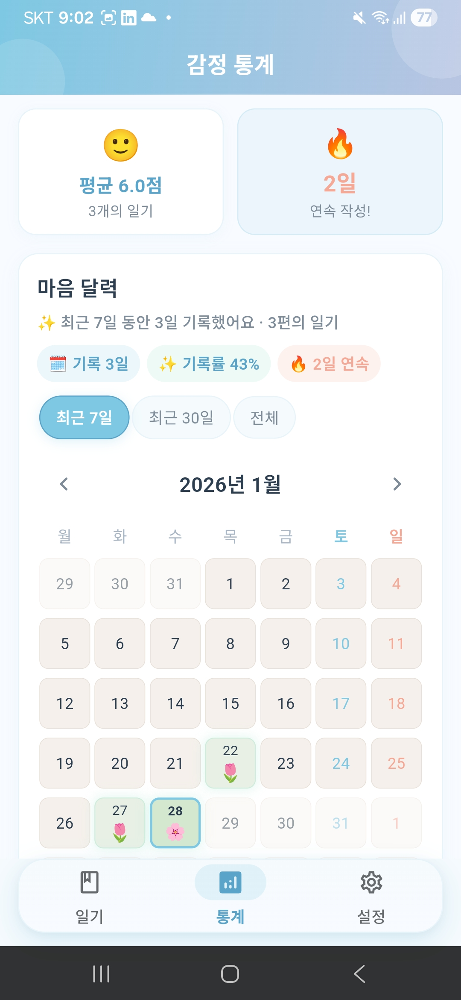
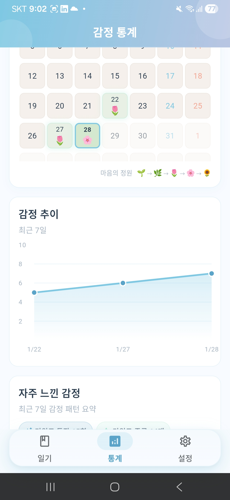
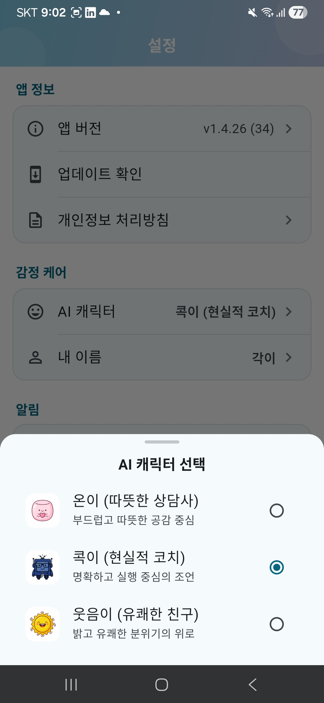

# MindLog (마음 로그) 🧠📝

**AI 기반 감정 케어 다이어리**

MindLog는 사용자의 일기를 분석하여 감정 상태를 파악하고, 위로의 메시지와 맞춤형 행동 지침을 제공하는 스마트 다이어리 앱입니다.

## 📱 스크린샷

<p align="center">
  
  
  
  <br/>
  
  
  
</p>

| 일기 목록 | 일기 작성 | 마음 달력 |
|:---:|:---:|:---:|
| 날짜별 일기 목록과 감정 키워드 태그 | 오늘의 마음을 기록하는 작성 화면 | 감정 점수를 식물 성장으로 시각화 |

| 감정 추이 | 키워드 분석 | AI 캐릭터 |
|:---:|:---:|:---:|
| 시간에 따른 감정 변화 차트 | 자주 등장하는 감정 키워드 시각화 | 공감 스타일을 선택하는 캐릭터 설정 |

## ✨ 주요 기능

### 📝 일기 작성 및 저장
- 로컬 데이터베이스(SQLite)에 안전하게 저장
- 날짜별 일기 관리 및 조회

### 🤖 AI 감정 분석
- 초고속 **Groq API (Llama 3.3)** 를 사용하여 실시간에 가까운 분석 제공
- 감정 키워드 추출 및 감정 점수 산출 (0~100)
- 공감 메시지 및 맞춤형 추천 행동 제안
- AI 캐릭터 선택으로 공감 톤 및 행동 제안 스타일 분리
- 강화된 분석 프롬프트로 정확도 향상

### 📊 감정 통계 대시보드
- **감정 추이 차트**: 시간에 따른 감정 점수 변화를 라인 차트로 시각화
- **감정 정원**: 일기 작성 빈도와 감정 점수를 🌱→🌿→🌷→🌸→🌻 식물 성장으로 시각화
- **키워드 태그 클라우드**: 자주 등장하는 감정 키워드 시각화
- 주간/월간 통계 요약

### ⚙️ 설정
- 알림 설정
- 테마 설정 (다크모드 지원 예정)
- 데이터 관리

## 🚀 시작하기 (Setup)

### 1. 환경 변수 설정 (dart-define)

보안상 `.env` 파일은 로드하지 않습니다. `--dart-define` 또는 제공된 스크립트로 키를 주입하세요.

#### 방법 A: dart-define 🔐

```bash
# 개발 실행
flutter run --dart-define=GROQ_API_KEY=your_key

# 릴리즈 APK 빌드
flutter build apk --release --dart-define=GROQ_API_KEY=your_key

# 릴리즈 App Bundle 빌드
flutter build appbundle --release --dart-define=GROQ_API_KEY=your_key
```

#### 방법 B: 스크립트 사용

```bash
# 키를 환경 변수로 전달
GROQ_API_KEY=your_key ./scripts/run.sh run
GROQ_API_KEY=your_key ./scripts/run.sh build-apk
GROQ_API_KEY=your_key ./scripts/run.sh build-appbundle
```

### 2. 패키지 설치

```bash
flutter pub get
```

### 3. 앱 실행

```bash
flutter run --dart-define=GROQ_API_KEY=your_key
# 또는
GROQ_API_KEY=your_key ./scripts/run.sh run
```


## 🔧 트러블슈팅

알려진 이슈와 해결 방법:

| 이슈 | 원인 | 해결 |
|------|------|------|
| [Release 빌드에서 예약 알림 미작동](docs/troubleshooting/notification-not-firing-release.md) | Proguard/R8 난독화 | keep 규칙 추가 |

## 🛠 변경 사항 (Changelog)

### v1.4.28 (Current)
*   **CI/CD 배포 파이프라인 안정화:**
    *   **Concurrency 설정 추가:** `cd.yml`에 concurrency 그룹 설정으로 동일 브랜치 중복 배포 방지
    *   **cancel-in-progress: false:** 진행 중인 배포는 취소하지 않고 순차 실행
*   **Fastlane API 키 주입 개선:**
    *   **GROQ_API_KEY 환경변수 전달:** cd.yml에서 Fastlane deploy 단계에 GROQ_API_KEY 전달
    *   **프로덕션 빌드 검증:** Fastfile에서 API 키 누락 시 빌드 실패로 품질 보장
    *   **dart-define 주입:** `flutter build appbundle/apk`에 `--dart-define=GROQ_API_KEY` 적용
*   **Firebase Functions 코드 정리:**
    *   **timeSlot 파라미터 추가:** `getTodayMessage(timeSlot)` 호출로 시간대별 정확한 메시지 선택
    *   **데드 코드 제거:** `getKSTHour()`, `getDefaultMessageByTimeOfDay()` 미사용 함수 삭제
    *   **`getMessageByTimeSlot()` 통일:** 모든 시간대 메시지 선택을 단일 함수로 처리
*   **스킬 카탈로그 업데이트:**
    *   **CI/CD Commands 섹션 추가:** `/cd-diagnose`, `/fastlane-audit` 커맨드 문서화
    *   **TIL 저장 커맨드 추가:** `/til-save [topic]` 커맨드 문서화
    *   **CD 트러블슈팅 워크플로우:** `/fastlane-audit` → `/cd-diagnose` → 수정 → 재배포 가이드

### v1.4.27
*   **저녁 마음케어 알림 추가 (Firebase Functions):**
    *   **2회 알림 시스템:** 기존 아침 9시 + 신규 저녁 9시 알림 스케줄 구성
    *   **`scheduledEveningNotification` 함수 신규:** 저녁 전용 메시지 ("오늘 하루는 어떠셨나요?", "마음 정리할 시간이에요" 등)
    *   **시간대별 Idempotency:** 아침/저녁 각각 독립적인 중복 발송 방지 (`2024-01-15_morning`, `2024-01-15_evening` 키)
    *   **`getMessageByTimeSlot()` 함수:** 시간대 파라미터로 적합한 메시지 선택
*   **KST 시간대 버그 수정:**
    *   **명시적 KST 변환:** Firebase Functions가 UTC에서 실행되므로 `Intl.DateTimeFormat` 사용
    *   **`getKSTHour()` 함수:** UTC→KST 시간 변환으로 정확한 시간대 판별
    *   **`getTodayKey()` 수정:** `toISOString()` → `Intl.DateTimeFormat('en-CA', {timeZone})` 패턴
*   **CI/CD Fastlane 통합:**
    *   **cd.yml 리팩토링:** `r0adkll/upload-google-play` GitHub Action → Fastlane `deploy_internal` lane
    *   **Ruby/Bundler 설정 추가:** `ruby/setup-ruby@v1` + bundler-cache 설정
    *   **빌드 프로세스 통합:** Flutter 빌드 + Play Store 업로드를 Fastfile에서 통합 관리
    *   **서비스 계정 키 동적 생성:** CI에서 `play-store-key.json` 파일 생성
*   **스크린샷 v3 개편:**
    *   **9개 스크린샷 리네이밍:** KakaoTalk 파일명 → 시맨틱 네이밍 (`01_splash_onboarding.jpeg` ~ `09_settings_bottom.jpeg`)
    *   **Fastlane metadata 구조:** `android/fastlane/metadata/android/{ko,en-US}/images/phoneScreenshots/`
    *   **README/GitHub Pages 업데이트:** v2→v3 스크린샷 경로 변경
    *   **`upload_screenshots` lane 추가:** Play Store 스크린샷 자동 업로드 지원

### v1.4.26
*   **코드 리뷰 기반 아키텍처 개선 (HIGH~LOW 이슈 수정):**
    *   **DI 계층 분리:** `infra_providers.dart`를 `presentation/providers/` → `core/di/`로 이전
        *   Clean Architecture 의존성 방향 준수 (presentation → domain ← data)
        *   기존 경로에 re-export 파일을 유지하여 하위 호환성 확보
    *   **main.dart 리팩토링:**
        *   `data/datasources/` 직접 import 제거 → DI Provider를 통한 간접 접근
        *   초기화 로직을 `_initializeApp()` 함수로 추출 (단일 책임 원칙)
        *   `MaterialApp` → `MaterialApp.router` 전환 (GoRouter 완전 통합)
        *   `NavigatorObserver`, `navigatorKey`를 GoRouter에서 중앙 관리
        *   15초 안전 타임아웃 적용 (`Future.any`)으로 무한 대기 방지
        *   FCM/알림 재스케줄링을 `unawaited`로 비차단 처리하여 앱 시작 속도 개선
    *   **FCMService 안전성 강화:**
        *   `_messaging!` force unwrap 3건 → 로컬 변수 캡처 패턴으로 교체
        *   APNS 토큰 재시도 횟수 10회 → 3회 최적화
    *   **NotificationActionHandler GoRouter 마이그레이션:**
        *   `Navigator.popUntil/push` → `context.go/push` 교체
        *   `DiaryScreen` 직접 import 제거 → `AppRoutes.diaryNew` 경로 사용
    *   **DB 복원 서비스 개선:** `forceReconnect()` 호출을 DI Provider 경유로 변경
*   **하드코딩 색상 중앙화 (MEDIUM):**
    *   **AppColors에 16개 신규 상수 추가:**
        *   `gardenLegacy1~5`: 감정 정원 배경색 (기존 hex 값 대체)
        *   `actionAmber`, `actionAmberDark`, `actionStep1~3`: 행동 추천 UI 색상
        *   `sosCardBackground`, `sosCardBorder`, `sosIcon`, `sosTextDark`, `sosTextDarker`, `sosButton`: SOS 카드 색상
    *   **emotion_garden.dart:** 5개 `Color(0xFF...)` → `AppColors.gardenLegacy1~5`
    *   **sos_card.dart:** 8개 `Colors.red.*` → `AppColors.sos*` 상수
    *   **action_items_section.dart:** 11개 `Colors.amber/green/orange/blue/grey` → `AppColors.action*/textHint/textSecondary`
*   **데드 코드 제거 & Null Safety 강화 (LOW):**
    *   **diary_list_screen.dart:** 빈 `// TODO: 설정 화면 이동` → `context.goSettings()` 실제 구현
    *   **statistics_screen.dart:** `period.days!` force unwrap → 로컬 변수 캡처 패턴 적용
*   **검증:** `flutter analyze` 0건, `flutter test` 837/837 통과

### v1.4.25
    *   **DiaryListScreen 분해:** 340줄 감소 — 목록 화면을 다수의 재사용 가능한 위젯으로 분리
        *   `TappableCard`: scale + shadow 애니메이션이 있는 범용 탭 피드백 카드
        *   `WriteFab`: 그라데이션 + 햅틱 피드백 FAB (오늘 기록하기)
        *   `ExpandableText`: 점진적 공개 패턴 (더 보기/접기) 텍스트 위젯
    *   **`DiaryDisplayExtension`:** Entity 표시 로직(이모지, 배경색 등)을 Extension 메서드로 분리
*   **go_router 네비게이션 마이그레이션:**
    *   **레거시 Navigator.push 전면 교체:** `diary_detail_screen`, `diary_screen`, `splash_screen`, `settings_sections` 등
    *   **context.push / context.go 통일:** 선언적 라우팅으로 딥링크 대응 및 뒤로가기 일관성 확보
    *   **라우트 경로 상수화:** `AppRouter.diaryPath`, `AppRouter.diaryDetailPath` 등 중앙 관리
*   **Soft Delete & Undo 패턴:**
    *   **DiaryListController 신규:** `AsyncNotifier` 기반 일기 목록 상태 관리
    *   **softDelete():** 리스트 즉시 제거 + 5초 Timer 후 실제 DB 삭제
    *   **cancelDelete():** Undo SnackBar로 삭제 취소 시 리스트 복원
    *   **togglePin():** 낙관적 업데이트(Optimistic Update) 적용 핀 토글
    *   **ref.onDispose():** Timer 생명주기 관리로 메모리 누수 방지
*   **테마 색상 마이그레이션:**
    *   **하드코딩 제거:** `Colors.white` → `colorScheme.onPrimary`, `Colors.black` → `colorScheme.shadow`
    *   **DeleteDiaryDialog:** `colorScheme.surface`, `surfaceContainerHighest`, `error` 적용
    *   **ResultCard 계열:** `emotion_insight_card`, `empathy_message`, `action_items_section` 테마 색상 적용
*   **한국어 텍스트 필터 고도화:**
    *   **4단계 NLP 파이프라인:** 문법 교정 → 존칭 정규화 → CJK 문자 제거 → 후처리
    *   **Self-Check Protocol 프롬프트:** AI 응답 내 한자/일본어 자체 검증 지시 추가
    *   **테스트 136건 추가:** 문법 교정, 존칭 일관성, CJK 필터링, 복합 케이스 검증
*   **ExpandableText 품질 수정:**
    *   **미사용 mixin 제거:** `SingleTickerProviderStateMixin` 정리
    *   **build 내 상태 변이 수정:** `_hasOverflow` 인스턴스 필드 → `hasOverflow` 지역 변수
*   **코드 리뷰 기반 마이너 수정 4건:**
    *   `TappableCard` shadow color 테마 대응
    *   `WriteFab` icon/text color 테마 대응
    *   `ExpandableText` 미사용 코드 정리
    *   `DiaryListController` Timer dispose 안전성

### v1.4.24
*   **성능 최적화 (Isolate & RepaintBoundary):**
    *   **Isolate 기반 이미지 처리:** `ImageService`의 이미지 압축/Base64 인코딩을 별도 Isolate에서 수행
    *   **UI 스레드 블로킹 방지:** 대용량 이미지 처리 시에도 60fps 유지
    *   **RepaintBoundary 적용:** 차트, 히트맵, 정원 위젯에 불필요한 리페인트 방지
    *   **`compute()` 함수 활용:** Flutter의 공식 Isolate 헬퍼로 안정적인 백그라운드 처리
*   **위젯 모듈화 리팩토링:**
    *   **SettingsScreen 분해:** 1,224줄 → 200줄 + 9개 서브 컴포넌트
        *   `SettingsCard`, `SettingsItem`, `SettingsTrailing`, `SettingsSections`
        *   `PermissionDialogs`, `UserNameDialog`, `AICharacterSheet`, `SettingsUtils`
    *   **ResultCard 분해:** 791줄 → 100줄 + 7개 서브 컴포넌트
        *   `CharacterBanner`, `EmpathyMessage`, `SentimentDashboard`, `EmotionInsightCard`
        *   `KeywordsSection`, `ActionItemsSection`, `SosCard`
    *   **EmotionCalendar 분해:** 414줄 → 100줄 + 3개 서브 컴포넌트
        *   `CalendarHeader`, `DayCell`, `CalendarLegend`
*   **Provider 중앙화:**
    *   **`ui_state_providers.dart` 신규:** 분산된 UI 상태 Provider들을 단일 파일로 통합
    *   **중복 제거:** `isAnalyzingProvider`, `isLoadingProvider` 등 중복 선언 정리
    *   **의존성 명확화:** 각 화면별 Provider 의존 관계 정리
*   **문서 및 규칙 정비:**
    *   **AGENTS.md 제거:** 더 이상 사용하지 않는 레거시 문서 삭제
    *   **CLAUDE.md 구조화:** 프로젝트 온보딩 문서 대폭 개선
    *   **`.claude/rules/` 체계화:** 아키텍처, 레이어별, 테스트, 빌드 규칙 분리
    *   **스킬 카탈로그 추가:** `/arch-check`, `/widget-decompose`, `/provider-centralize`, `/refactor-plan`, `/session-wrap`

### v1.4.23
*   **Google Play Photo/Video Permissions 정책 준수:**
    *   **`READ_MEDIA_IMAGES` 권한 제거:** Google Play의 2025년 1월 Photo/Video Permissions 정책에 대응
    *   **Android Photo Picker 도입:** Android 13+ (API 33+)에서 시스템 Photo Picker 사용으로 전환
    *   **권한 요청 불필요:** 사용자에게 별도의 미디어 권한 요청 없이 사진 선택 가능
    *   **하위 호환성 유지:** Android 12 이하에서는 `READ_EXTERNAL_STORAGE` (maxSdkVersion=32) 사용
*   **의존성 업그레이드:**
    *   **`image_picker`:** ^1.0.7 → ^1.2.1 (Photo Picker API 지원)
    *   최신 Android/iOS API 지원 및 안정성 향상
*   **AndroidManifest.xml 권한 정리:**
    *   `READ_MEDIA_IMAGES` 권한 선언 제거
    *   주석 업데이트로 권한 전략 문서화

### v1.4.22
*   **📷 이미지 첨부 기능 (Vision API 연동):**
    *   **일기에 이미지 첨부:** 최대 5개 이미지 첨부 지원 (갤러리/카메라 선택)
    *   **Groq Vision API 통합:** `meta-llama/llama-4-scout-17b-16e-instruct` 모델로 이미지+텍스트 종합 분석
    *   **이미지 자동 처리:** 앱 디렉토리로 복사 + 4MB 초과 시 자동 압축 (품질 85%, 최대 1920px)
    *   **Base64 인코딩:** Vision API 전송을 위한 Data URL 인코딩 처리
    *   **Vision 프롬프트 전용 설계:** 이미지 속 표정, 환경, 분위기를 분석하여 감정 파악 정확도 향상
*   **새 위젯 및 서비스 추가:**
    *   **`ImageService`:** 이미지 복사, 압축, Base64 인코딩, 삭제 담당 서비스 클래스
    *   **`ImagePickerSection`:** 갤러리/카메라 이미지 선택 UI 위젯
    *   **`DiaryImageGallery`:** 첨부된 이미지 그리드 표시 위젯
    *   **`DiaryImageIndicator`:** 이미지 첨부 여부 표시 아이콘 위젯
    *   **`FullscreenImageViewer`:** 이미지 전체화면 보기 + 제스처 확대/축소
*   **Domain Layer 확장:**
    *   **`Diary` 엔티티:** `imagePaths` 필드 추가 (nullable, 하위 호환성 유지)
    *   **`DiaryRepository`:** `createDiary()`, `analyzeDiary()` 메서드에 이미지 경로 파라미터 추가
    *   **`AnalyzeDiaryUseCase`:** 이미지 유효성 검사 + 처리 로직 추가
*   **에러 처리 확장:**
    *   **`ImageProcessingException`:** 이미지 처리 중 발생하는 예외
    *   **`ImageProcessingFailure`:** Sealed Failure 클래스에 이미지 처리 실패 타입 추가
    *   **`FailureMapper`:** `ImageProcessingException` → `ImageProcessingFailure` 매핑 추가
*   **새 패키지 추가:**
    *   `image_picker: ^1.0.7` - 갤러리/카메라 이미지 선택
    *   `flutter_image_compress: ^2.1.0` - 이미지 압축 처리
*   **테스트 추가:** ImageService, 이미지 위젯 테스트 5개 파일 추가

### v1.4.21
*   **감정 달력(EmotionCalendar) 위젯 전면 개편:**
    *   **기존 EmotionGarden → EmotionCalendar 전환:** 주간 히트맵에서 월간 캘린더 UI로 변경
    *   **PageView 기반 월 네비게이션:** 스와이프로 월 이동, 좌우 버튼 및 "오늘" 바로가기 지원
    *   **식물 성장 이모지 시각화:** 감정 점수 1-2점 🌱 → 3-4점 🌿 → 5-6점 🌷 → 7-8점 🌸 → 9-10점 🌻
    *   **마이크로 인터랙션:** 탭 시 scale 애니메이션, 친근한 툴팁 메시지 ("이 날은 정원이 쉬었어요 🌙")
    *   **접근성 준수:** `MediaQuery.disableAnimations` 감지하여 모션 축소 시 애니메이션 비활성화
*   **시간대별 푸시 알림 메시지 분리 (Firebase Functions):**
    *   **아침 메시지 (5-11시):** "좋은 아침이에요! ☀️", "상쾌한 아침이에요 🌅" 등 8종 활기찬 메시지
    *   **저녁 메시지 (12-4시, 5시 이후):** "오늘 하루는 어떠셨나요?", "마음 정리할 시간이에요 🌙" 등 5종 마무리 메시지
    *   **`getDefaultMessageByTimeOfDay()` 함수:** KST 기준 시간대 판별 로직 구현
    *   **MessageCategory 타입 확장:** `"morning"` 카테고리 추가
*   **테마 색상 확장 (Warm Garden Colors):**
    *   **따뜻한 정원 색상 팔레트:** `gardenWarm1~5` (크림 → 베이지 → 연민트 → 민트 → 연초록)
    *   **Glow 색상 추가:** `gardenGlow` (성취감 강조), `todayGlow` (오늘 강조 모카신)
*   **위젯 테스트 추가:** EmotionCalendar 테스트 26개 (이모지 매핑, 빈 데이터, 범례, 요일 라벨, 월 네비게이션, 스와이프, 다크 모드 등)

### v1.4.20
*   **테스트 커버리지 92.5% 달성:**
    *   **전체 테스트:** 665개 (57개 신규 추가)
    *   **core/theme 완전 테스트:** 0% → 95.7%로 향상
*   **신규 테스트 영역:**
    *   `AppColors`, `AppTheme`, `SplashTheme` 테마 시스템 검증
    *   `SqliteLocalDataSource`, `PreferencesLocalDataSource` 로컬 데이터 레이어
    *   `GroqRemoteDataSource` AI API 연동 테스트
    *   `AnalysisResponseDto` 파싱 및 에지 케이스 처리
    *   `Diary`, `Statistics` 도메인 엔티티 검증
*   **테스트 인프라 강화:**
    *   `MockHttpClient` 도입으로 API 테스트 안정화
    *   기존 알림, 분석 파서, 리포지토리, 컨트롤러 테스트 보강

### v1.4.19
*   **테스트 커버리지 대폭 확대:**
    *   **전체 커버리지:** 91.9% → 92.5% (1,809줄 중 1,673줄 커버)
    *   **테스트 수:** 608개 → 665개 (57개 추가)
    *   **core/theme 완전 테스트:** 0% → 95.7% (AppColors, AppTheme, SplashTheme)
    *   **Data Layer 강화:** DataSource, DTO, Repository 테스트 추가
*   **신규 테스트 파일:**
    *   `test/core/theme/app_colors_test.dart` - 감정/히트맵 색상 매핑 테스트
    *   `test/core/theme/app_theme_test.dart` - 라이트/다크 테마 검증
    *   `test/core/theme/splash_theme_test.dart` - 스플래시 테마 검증
    *   `test/data/datasources/` - Local/Remote DataSource 테스트
    *   `test/data/dto/analysis_response_dto_test.dart` - AI 응답 파싱 테스트

### v1.4.18
*   **알림 메시지 다양화 (연구 기반):**
    *   **랜덤 메시지 시스템:** 고정 메시지 → 8개 제목 x 8개 본문 랜덤 조합
    *   **NotificationMessages 상수 클래스:** `dart:math` Random 주입 패턴으로 테스트 가능성 확보
    *   **Record 타입 적용:** Dart 3.0+ `({String title, String body})` 반환으로 타입 안전성 강화
*   **기본 알림 시간 최적화:**
    *   **연구 기반 시간 변경:** 21:00 → 19:00 (PMC 연구: 17:00-20:00 참여율 최고)
    *   **직장인 타겟팅:** 퇴근 후 여유 시간대에 알림 도달
*   **DB 복구 시스템 (OS 백업 대응):**
    *   **문제:** 앱 재설치 후 OS 복원 데이터가 목록에 표시되나 통계 미반영
    *   **원인:** Static singleton `_database`가 이전 연결 캐싱 → 복원된 DB 파일 미인식
    *   **해결:** `forceReconnect()` + `DbRecoveryService` 세션 ID 비교 (SharedPreferences vs DB)
    *   **스키마:** v4 → v5 마이그레이션, `app_metadata` 테이블 추가
*   **테스트 추가:** NotificationMessages 테스트 18개 추가 (총 230개)

### v1.4.17
*   **감정 정원(Emotion Garden) 디자인 도입:**
    *   **기존 히트맵 → 감정 정원:** 개발자 스타일 GitHub 잔디심기 → 일반 사용자 친화적 식물 성장 메타포
    *   **이모지 기반 시각화:** 감정 점수에 따라 🌱씨앗 → 🌿새싹 → 🌷꽃봉오리 → 🌸꽃 → 🌻해바라기로 성장
    *   **스토리텔링 툴팁:** "🌸 꽃이 활짝! 평균 8.5점의 하루" 등 감성적 메시지
    *   **범례 개선:** "마음의 정원 🌱→🌿→🌷→🌸→🌻" 직관적 안내
*   **테스트 추가:** EmotionGarden 위젯 테스트 11개 추가

### v1.4.16
*   **코드 품질 및 안정성 전면 개선 (Code Review P0-P3):**
    *   **P0 Critical Fixes:**
        *   Circuit Breaker 레이스 컨디션 해결 (Lock 패턴 적용)
        *   SQLite DateTime/DiaryStatus 파싱 안전성 강화
        *   API 응답 민감정보 노출 방지 (에러 메시지 정리)
        *   ValidationFailure null assertion 오류 수정
    *   **P1 High Priority Fixes:**
        *   Rate Limit 429 에러 핸들링 및 Retry-After 헤더 파싱 추가
        *   `Diary.copyWith` nullable 필드 처리 개선
    *   **P2 Medium Priority Fixes:**
        *   `AnalysisResult.analyzedAt` DateTime.now() 의존성 제거 (필수 파라미터화)
        *   Emoji 매핑 로직 Presentation Layer로 이동 (Clean Architecture 준수)
    *   **P3 Optimization:**
        *   시스템 프롬프트 캐싱으로 토큰 비용 절감
        *   SQLite 복합 인덱스 최적화 (DB v4: `is_pinned DESC, created_at DESC`)
        *   테스트용 Clock/Random 주입 패턴 표준화 (`lib/core/utils/clock.dart`)
*   **테스트 커버리지 확대:** 181 → 201 테스트 (20개 추가)
    *   Clock 유틸리티 테스트 (`test/core/utils/clock_test.dart`)
    *   PromptConstants 캐싱/시간 주입 테스트 (`test/core/constants/prompt_constants_test.dart`)

### v1.4.15
*   **감정 이모지 동적 애니메이션:**
    *   **감정별 차별화:** 낮은 점수(1-4)는 느린 등장 + 미세한 떨림(무게감), 높은 점수(7-10)는 빠른 바운스 + 회전(활력)
    *   **EmotionAnimationConfig:** 감정 점수별 Duration, Curve, Shake/Rotation 파라미터화
    *   **게이지바 shimmer 효과:** 달성감을 강조하는 은은한 빛남 효과
*   **UI 마이크로 인터랙션:**
    *   **일기 목록 stagger 애니메이션:** 초기 로드 시 순차적 fadeIn + slideX 효과 (50ms delay per item)
    *   **카드 탭 피드백:** AnimatedScale(0.97) + 그림자 변화 + 햅틱 피드백
    *   **FAB 탭 효과:** 버튼 축소(0.95) + 그림자 감소 + mediumImpact 햅틱
*   **접근성 강화:**
    *   **AnimationSettings 유틸리티:** Reduced Motion 시스템 설정 감지
    *   **WCAG 2.1 AA 준수:** 사용자가 모션 감소를 선호할 경우 애니메이션 비활성화
    *   **이모지 Semantics:** 스크린 리더용 감정 점수 및 상태 레이블 제공

### v1.4.14
*   **유저 이름 기반 AI 상담 개인화:**
    *   **이름 설정 기능:** 설정 화면에서 사용자 이름을 입력하면 AI 상담사가 이름을 불러줍니다
    *   **프롬프트 개인화:** empathy_message에 "OO님"으로 한 번 자연스럽게 호칭
    *   **선택적 적용:** 이름 미설정 시 기존 방식 그대로 유지
*   **아키텍처 준수:**
    *   **Clean Architecture 패턴:** Domain/Data/Presentation 계층 분리 유지
    *   **UserNameController 추가:** Riverpod AsyncNotifier 기반 상태 관리
    *   **프라이버시 보호:** 이름은 로컬 SharedPreferences에만 저장 (서버 전송 없음)

### v1.4.13
*   **GitHub Pages 개선:**
    *   **디자인 통일:** 앱 테마와 색상 시스템 통일 (Sky Blue #7EC8E3, Coral/Mint 액센트)
    *   **트러블슈팅 JSON 경로 수정:** 404 오류 해결
    *   **원래 퍼플 그라데이션 디자인 복원:** Google Play 링크, v2 스크린샷, 업데이트 섹션 추가
*   **문서 최적화:**
    *   **스킬 문서 77% 압축:** ~1,330줄 감소로 토큰 효율 향상
    *   **P1/P2 스킬 테이블 형식 전환:** CLAUDE.md에서 간결하게 참조
    *   **CHANGELOG 상세화:** v1.4.1~v1.4.12 상세 릴리스 노트 추가

### v1.4.12
*   **마음 케어 알림 활성화 UX:**
    *   **설정 토글 추가:** 마음 케어 알림을 설정에서 구독/해제 가능
    *   **첫 활성화 환영 다이얼로그:** SharedPreferences 기반 1회 안내 + 재활성화 SnackBar 피드백
    *   **Analytics 이벤트 추가:** mindcare_enabled / mindcare_disabled 로깅
*   **마음 케어 발송 인프라 구축:**
    *   **Cloud Functions 추가:** 매일 오전 9시(KST) 자동 발송, 관리자용 HTTP API(수동 발송/메시지 추가/상태 조회)
    *   **FCM 토픽 발송 서비스:** mindlog_mindcare 토픽 메시지 전송 및 공통 payload 구성
    *   **Firestore 구성/보안:** 메시지/발송 로그/통계 컬렉션, rules 및 indexes 추가
*   **문서/자산 정리:**
    *   **개인정보 처리방침 경로 변경:** `docs/legal/privacy-policy.md` 기준으로 assets 연동
*   **테스트 보강:**
    *   **에러/서킷브레이커/업데이트:** FailureMapper, 예외/Failure, CircuitBreaker, UpdateService, NotificationService 테스트 추가
    *   **UI/도메인:** MindcareWelcomeDialog 위젯 테스트, NotificationSettings 엔티티 테스트 추가

### v1.4.11
*   **트러블슈팅 문서 시스템 추가:**
    *   **트러블슈팅 게시판:** GitHub Pages에 알려진 이슈와 해결 방법을 확인할 수 있는 페이지 추가
    *   **웹 모달 마크다운 뷰어:** MD 파일을 다운로드 없이 웹에서 바로 확인 가능
    *   **필터 및 검색:** 상태/카테고리별 필터링과 키워드 검색 지원
*   **알림 안정성 강화:**
    *   **Proguard keep 규칙 추가:** Release 빌드에서 예약 알림이 정상 동작하도록 수정

### v1.4.10
*   **개인정보/정책 정비:**
    *   **광고 ID 권한 제거:** AD_ID/AdServices 관련 권한을 제외했어요.
    *   **Analytics 설정 강화:** 광고 ID 수집을 비활성화했어요.
*   **코드 정리:**
    *   **간단한 줄바꿈 정리:** `main.dart`의 불필요한 줄바꿈을 제거했어요.

### v1.4.9
*   **알림 리마인더 추가:**
    *   **시간 설정 및 테스트 알림:** 매일 알림 시간 지정과 즉시 테스트 알림 제공
    *   **재부팅/업데이트 복구:** 예약된 알림을 자동으로 복구
    *   **권한 안내 강화:** 알림 권한/정확한 알람/배터리 최적화 안내 제공
*   **Firebase 연동:**
    *   **Analytics 이벤트 수집:** 주요 행동 로그를 추적하여 개선 기반 마련
    *   **Crashlytics 안정성 강화:** 전역 에러 수집 및 안정성 향상
    *   **FCM 푸시 처리:** 알림 수신/이동 처리 기반 추가

### v1.4.8
*   **AI 분석 고도화:**
    *   **정교한 감정 분석:** 1차/2차 감정 분류 및 감정 유발 원인 분석 기능 추가
    *   **에너지 레벨 측정:** 현재 에너지 상태를 1~10 단계로 분석하여 제공
    *   **단계별 행동 지침:** '지금 바로', '오늘 중으로', '이번 주' 3단계로 나누어 구체적인 행동 제안
*   **UI/UX 개선:**
    *   **분석 결과 카드 리뉴얼:** 감정 온도계, 에너지 게이지, 단계별 체크리스트 등 시각화 강화
    *   **축하 효과:** 행동 지침 완료 시 축하 애니메이션 및 효과 추가
*   **시스템 개선:**
    *   **보안 강화:** 환경 변수 설정 구조 개편 (dart-define 우선 적용)
    *   **데이터 구조 최적화:** 새로운 분석 필드 저장을 위한 DB 스키마 업데이트

### v1.4.7
*   **일기 개별 삭제 기능:** 상세 화면에서 삭제 버튼으로 일기를 삭제할 수 있어요.
*   **스와이프 삭제 지원:** 목록에서 왼쪽으로 스와이프하여 빠르게 삭제할 수 있어요.
*   **삭제 확인 다이얼로그:** 실수로 삭제하지 않도록 확인 과정을 거쳐요.
*   **CI/CD 빌드 수정:** 배포 빌드 시 API Key 주입 문제를 해결했어요.

### v1.4.6
*   **분석 안정성 강화:** 실패/차단 상태 처리가 명확해지고 재시도 흐름이 정리됐어요.
*   **로딩 애니메이션 안정화:** dispose 이후 컨트롤러 호출을 방지해 런타임 오류를 줄였어요.
*   **Groq 전용 파이프라인 정리:** Gemini 폴백과 dotenv 의존성을 제거하고 dart-define 실행으로 통일했어요.
*   **네트워크 보호 로직 추가:** 서킷 브레이커로 반복 실패를 제어해요.

### v1.4.5
*   **원격 변경사항 연동:** 변경사항 화면이 GitHub Pages JSON에서 실시간 데이터를 가져오도록 개선
*   **이전 버전 변경사항 표시:** 최신 버전 외에 이전 버전들의 변경사항도 접이식으로 확인 가능
*   **네트워크 오류 처리 개선:** 변경사항 로딩 실패 시 재시도 버튼 제공

### v1.4.4
*   **AI 캐릭터 이름 부여:** 각 캐릭터에 친근한 이름 추가
    *   따뜻한 상담사 → **온이** (따뜻함의 '온')
    *   현실적 코치 → **콕이** (핵심을 콕콕 짚어주는)
    *   유쾌한 친구 → **웃음이** (웃음을 전해주는)

### v1.4.3
*   **AI 캐릭터 도입:** 따뜻한 상담사/현실적 코치/유쾌한 친구 중 선택 가능
*   **캐릭터별 응답 스타일 강화:** 공감 메시지와 행동 제안 톤을 캐릭터에 맞게 분리
*   **캐릭터 배지/이미지 표시:** 설정 선택 리스트 및 분석 결과 카드에 캐릭터 이미지 노출
*   **일기별 캐릭터 고정 기록:** 작성 시점 캐릭터가 기록에 저장되어 이후 변경에도 유지
*   **통계 즉시 반영:** 일기 분석 완료 후 통계 데이터 자동 갱신

### v1.4.2
*   **성능 최적화:**
    *   **일기 목록 스크롤 개선:** `KeyedSubtree` + `ValueKey` 적용으로 프레임 드랍 해소 및 60fps 유지
    *   **히트맵 렌더링 최적화:** O(n²) → O(n) 알고리즘 개선으로 대규모 데이터에서도 빠른 렌더링
    *   **DB 쿼리 최적화:** `(status, created_at)` 복합 인덱스 추가로 조회 속도 향상
    *   **통계 계산 효율화:** 4-pass → 1-pass 단일 패스 알고리즘으로 CPU 사용량 감소
    *   **메모리 관리 개선:** Riverpod Provider에 `autoDispose` 적용으로 메모리 누수 방지
    *   **위젯 빌드 최적화:** `DateFormat` 인스턴스 static 캐싱 및 불필요한 정렬 제거

### v1.4.1
*   **로딩 온보딩 개선:** 테마 컬러 기반 로딩 인디케이터 + 배경 그라데이션/오브젝트로 균형감 강화
*   **앱 크롬 리디자인:** 그라데이션 AppBar, 바텀 네비게이션 필 인디케이터 + 표면감 보강
*   **네트워크 오버레이 톤 통일:** 로딩 상태 컬러를 테마 팔레트와 일치
*   **통계 화면 감성화:** '마음 달력' 섹션 도입, 기록 배지/카피 개선, 히트맵 셀/범례 리디자인
*   **감정 키워드 인사이트 강화:** 대표 감정 카드 + 비율/랭킹으로 의미 있는 요약 제공
*   **메인 CTA 개선:** '오늘 기록하기' 버튼을 파스텔 하늘색 캡슐 스타일로 리디자인
*   **스플래시 화면 리스킨:** 파스텔 그라데이션 배경과 카피/버튼/로딩 컬러 통일
*   **개발 문서 추가:** `AGENTS.md` 기여 가이드 제공
*   **도움말 UI 리디자인:** 설정 내 도움말 다이얼로그를 카드형 안내로 개선
*   **앱 버전/변경사항 화면 추가:** 실제 버전 표시 및 버전별 변경사항 화면 제공
*   **업데이트 확인 기능 도입:** 수동 업데이트 체크 + 업데이트 다이얼로그 스타일 개선
*   **원격 업데이트 JSON 연동:** GitHub Pages 기반 업데이트 설정 지원

### v1.4.0
*   **AI 감정 분석 고도화:**
    *   **시간대별 맞춤 추천:** 아침, 점심, 저녁 등 시간대에 최적화된 행동 지침(Action Item) 제공 로직 구현
    *   **프롬프트 강화:** 12가지 상황별 Few-shot 예시 추가로 응답의 정확도와 자연스러움 향상
    *   **다국어 필터링:** AI 응답에서 한자, 일본어 등을 완벽하게 제거하는 후처리 필터 적용
*   **UI/UX 대규모 업데이트:**
    *   **감정 분석 리포트:** 감정 온도계 게이지, 미션 완료 체크박스(성공 효과 포함) 등 인터랙티브 요소 추가
    *   **메인 화면:** 당겨서 새로고침(Pull-to-refresh) 기능 및 카드 디자인 개선
    *   **애니메이션:** `flutter_animate`를 활용한 부드러운 화면 전환 및 요소 등장이 효과 적용
*   **기능 추가:**
    *   **인앱 웹뷰(WebView):** 앱 이탈 없이 공지사항이나 약관을 확인할 수 있는 웹뷰 화면 구현
    *   설정 화면에 '개인정보 처리방침' 링크 연동

### v1.3.1
*   **앱 아이콘 리뉴얼:** 새로운 디자인의 앱 아이콘 적용 (Android/iOS)
*   **반응형 UI 고도화:**
    *   `ResponsiveUtils` 도입으로 화면 크기별 레이아웃 로직 중앙화
    *   전체 스크린(목록, 상세, 통계, 설정)에 일관된 반응형 패딩 및 폰트 적용
    *   가로 모드 및 태블릿 환경 사용성 개선
*   **AI 프롬프트 다양성 강화:**
    *   행동 제안(Action Item) 카테고리 8종 세분화 (마음챙김, 신체활동, 감각자극 등)
    *   Few-shot 예시 보강으로 상황에 맞는 다채로운 답변 유도

### v1.3.0
*   **반응형 UI 전면 개선:** 320dp~600dp+ 다양한 화면 크기 대응
    *   RenderFlex 오버플로우 이슈 해결 (통계 화면 헤더)
    *   Row/Column 안전 패턴 적용 (Flexible, Expanded 활용)
    *   터치 타겟 44dp 이상 보장 (Material Design 가이드라인 준수)
    *   텍스트 오버플로우 방어적 처리 (maxLines, ellipsis)
*   **활동 히트맵 개선:** 요일 표시 확장
    *   월~일 전체 7일 표시 (기존: 월, 수, 금만 표시)
    *   주말 색상 구분 (토요일: 파란색, 일요일: 코랄색)
*   **태블릿 대응:** 대형 화면 레이아웃 최적화
    *   SOS 카드 최대 너비 제한 (600dp)
    *   다이얼로그 콘텐츠 스크롤 지원
*   **UI 가이드라인 문서 추가:** `docs/ui/responsive_guidelines.md`
    *   브레이크포인트 정의 (Compact/Medium/Expanded)
    *   Row/Column 안전 패턴 가이드
    *   테스트 체크리스트

### v1.2.0
*   **통계 화면 UI 전면 개편:** 하늘색 파스텔 톤 테마로 통일된 디자인
    *   GitHub 스타일 활동 히트맵 (5단계 색상)
    *   요약 + 스트릭 카드 레이아웃
    *   감정 추이 라인 차트 개선
    *   키워드 태그 애니메이션 효과
*   **한글 필터링 유틸리티 추가:** AI 응답에서 한문(중국어), 일본어 자동 필터링
    *   `KoreanTextFilter` 클래스로 다국어 혼입 문제 해결
    *   키워드, 공감 메시지, 추천 행동 필터링 적용
*   **AI 프롬프트 강화:** Llama 3.3 70B 모델 최적화
    *   한국어 전용 응답 강제 지시
    *   Few-shot 예시 추가로 응답 품질 향상
*   **테마 시스템 개선:** `AppColors` 통계 전용 팔레트 추가
*   **코드 품질 개선:** 중복 코드 제거 및 리팩토링

### v1.1.0
*   **통계 기능 추가:** 감정 통계 대시보드 신규 구현
    *   감정 추이 라인 차트 (`fl_chart`)
    *   활동 히트맵 캘린더
    *   키워드 태그 클라우드
*   **새로운 화면:** 메인 화면, 설정 화면, 통계 화면 추가
*   **UI/UX 대폭 개선:** ResultCard 위젯 리뉴얼로 분석 결과 가독성 향상
*   **분석 정확도 향상:** AI 프롬프트 및 응답 파서 강화
*   **아키텍처 개선:** Clean Architecture 패턴 강화
*   **테스트 추가:** 핵심 로직 단위 테스트 구현

### v1.0.1
*   **AI 모델 변경:** Groq (`llama-3.3-70b-versatile`)로 전면 교체하였습니다.
*   **응답 속도 개선:** 분석 대기 시간이 획기적으로 단축되었습니다.
*   **보안 강화:** API Key를 `--dart-define`으로 주입하도록 변경했습니다.

## 🏗 프로젝트 구조

```
lib/
├── core/                    # 핵심 유틸리티 및 상수
│   ├── constants/           # 프롬프트, 안전 상수
│   ├── theme/               # 앱 테마 및 색상 정의
│   └── utils/               # 유틸리티 (한글 필터 등)
├── data/                    # 데이터 레이어
│   ├── datasources/         # 로컬/원격 데이터 소스
│   ├── dto/                 # 데이터 전송 객체
│   └── repositories/        # Repository 구현체
├── domain/                  # 도메인 레이어
│   ├── entities/            # 비즈니스 엔티티
│   ├── repositories/        # Repository 인터페이스
│   └── usecases/            # 비즈니스 로직
└── presentation/            # 프레젠테이션 레이어
    ├── providers/           # Riverpod 프로바이더
    ├── screens/             # 화면 위젯
    └── widgets/             # 재사용 위젯
```

## 📚 기술 스택

*   **Framework:** Flutter
*   **Language:** Dart
*   **State Management:** Riverpod
*   **Local DB:** SQLite (sqflite)
*   **AI API:** Groq (Llama 3.3) / Google Generative AI (Optional)
*   **Charts:** fl_chart
*   **Architecture:** Clean Architecture
