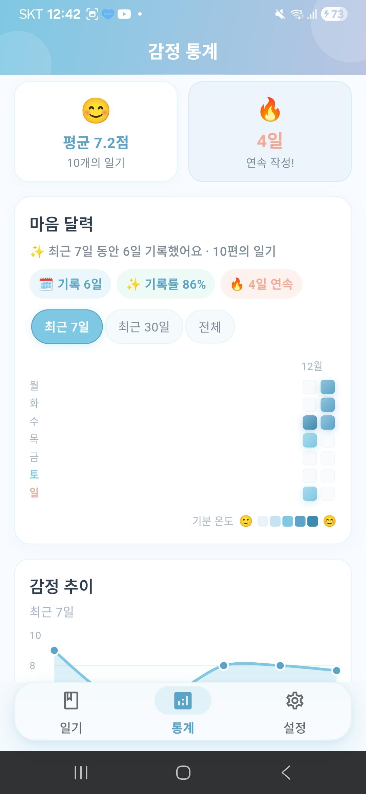

# MindLog (마음 로그) 🧠📝

**AI 기반 감정 케어 다이어리**

MindLog는 사용자의 일기를 분석하여 감정 상태를 파악하고, 위로의 메시지와 맞춤형 행동 지침을 제공하는 스마트 다이어리 앱입니다.

## 📱 스크린샷

<p align="center">
  
  
  
  <br/>
  
  
  
</p>

| 일기 목록 | 일기 작성 | 감정 통계 |
|:---:|:---:|:---:|
| 날짜별 일기 목록과 감정 키워드 태그 | 오늘의 마음을 기록하는 작성 화면 | 히트맵, 감정 추이 차트, 연속 작성 스트릭 |

| 통계 상세 | 설정 | 사용 가이드 |
|:---:|:---:|:---:|
| 기간별 통계 요약과 인사이트 | 앱 정보, 데이터 관리, 지원 | 시작 안내 및 사용 흐름 안내 |

## ✨ 주요 기능

### 📝 일기 작성 및 저장
- 로컬 데이터베이스(SQLite)에 안전하게 저장
- 날짜별 일기 관리 및 조회

### 🤖 AI 감정 분석
- 초고속 **Groq API (Llama 3.3)** 를 사용하여 실시간에 가까운 분석 제공
- 감정 키워드 추출 및 감정 점수 산출 (0~100)
- 공감 메시지 및 맞춤형 추천 행동 제안
- AI 캐릭터 선택으로 공감 톤 및 행동 제안 스타일 분리
- 강화된 분석 프롬프트로 정확도 향상

### 📊 감정 통계 대시보드
- **감정 추이 차트**: 시간에 따른 감정 점수 변화를 라인 차트로 시각화
- **활동 히트맵**: 일기 작성 빈도를 캘린더 형태로 표시
- **키워드 태그 클라우드**: 자주 등장하는 감정 키워드 시각화
- 주간/월간 통계 요약

### ⚙️ 설정
- 알림 설정
- 테마 설정 (다크모드 지원 예정)
- 데이터 관리

## 🚀 시작하기 (Setup)

### 1. 환경 변수 설정 (.env)

프로젝트 루트 경로에 `.env` 파일을 생성하고 아래와 같이 API 키를 설정해야 합니다.

```env
# Groq API Key (권장 - 속도 빠름)
# 키 발급: https://console.groq.com/keys
GROQ_API_KEY=your_groq_api_key_here

# (선택 사항) Gemini API Key (구버전 호환용)
GEMINI_API_KEY=your_gemini_api_key_here
```

### 2. 패키지 설치

```bash
flutter pub get
```

### 3. 앱 실행

```bash
flutter run
```

## 🛠 변경 사항 (Changelog)

### v1.4.4 (Current)
*   **AI 캐릭터 이름 부여:** 각 캐릭터에 친근한 이름 추가
    *   따뜻한 상담사 → **온이** (따뜻함의 '온')
    *   현실적 코치 → **콕이** (핵심을 콕콕 짚어주는)
    *   유쾌한 친구 → **웃음이** (웃음을 전해주는)

### v1.4.3
*   **AI 캐릭터 도입:** 따뜻한 상담사/현실적 코치/유쾌한 친구 중 선택 가능
*   **캐릭터별 응답 스타일 강화:** 공감 메시지와 행동 제안 톤을 캐릭터에 맞게 분리
*   **캐릭터 배지/이미지 표시:** 설정 선택 리스트 및 분석 결과 카드에 캐릭터 이미지 노출
*   **일기별 캐릭터 고정 기록:** 작성 시점 캐릭터가 기록에 저장되어 이후 변경에도 유지
*   **통계 즉시 반영:** 일기 분석 완료 후 통계 데이터 자동 갱신

### v1.4.2
*   **성능 최적화:**
    *   **일기 목록 스크롤 개선:** `KeyedSubtree` + `ValueKey` 적용으로 프레임 드랍 해소 및 60fps 유지
    *   **히트맵 렌더링 최적화:** O(n²) → O(n) 알고리즘 개선으로 대규모 데이터에서도 빠른 렌더링
    *   **DB 쿼리 최적화:** `(status, created_at)` 복합 인덱스 추가로 조회 속도 향상
    *   **통계 계산 효율화:** 4-pass → 1-pass 단일 패스 알고리즘으로 CPU 사용량 감소
    *   **메모리 관리 개선:** Riverpod Provider에 `autoDispose` 적용으로 메모리 누수 방지
    *   **위젯 빌드 최적화:** `DateFormat` 인스턴스 static 캐싱 및 불필요한 정렬 제거

### v1.4.1
*   **로딩 온보딩 개선:** 테마 컬러 기반 로딩 인디케이터 + 배경 그라데이션/오브젝트로 균형감 강화
*   **앱 크롬 리디자인:** 그라데이션 AppBar, 바텀 네비게이션 필 인디케이터 + 표면감 보강
*   **네트워크 오버레이 톤 통일:** 로딩 상태 컬러를 테마 팔레트와 일치
*   **통계 화면 감성화:** '마음 달력' 섹션 도입, 기록 배지/카피 개선, 히트맵 셀/범례 리디자인
*   **감정 키워드 인사이트 강화:** 대표 감정 카드 + 비율/랭킹으로 의미 있는 요약 제공
*   **메인 CTA 개선:** '오늘 기록하기' 버튼을 파스텔 하늘색 캡슐 스타일로 리디자인
*   **스플래시 화면 리스킨:** 파스텔 그라데이션 배경과 카피/버튼/로딩 컬러 통일
*   **개발 문서 추가:** `AGENTS.md` 기여 가이드 제공
*   **도움말 UI 리디자인:** 설정 내 도움말 다이얼로그를 카드형 안내로 개선
*   **앱 버전/변경사항 화면 추가:** 실제 버전 표시 및 버전별 변경사항 화면 제공
*   **업데이트 확인 기능 도입:** 수동 업데이트 체크 + 업데이트 다이얼로그 스타일 개선
*   **원격 업데이트 JSON 연동:** GitHub Pages 기반 업데이트 설정 지원

### v1.4.0
*   **AI 감정 분석 고도화:**
    *   **시간대별 맞춤 추천:** 아침, 점심, 저녁 등 시간대에 최적화된 행동 지침(Action Item) 제공 로직 구현
    *   **프롬프트 강화:** 12가지 상황별 Few-shot 예시 추가로 응답의 정확도와 자연스러움 향상
    *   **다국어 필터링:** AI 응답에서 한자, 일본어 등을 완벽하게 제거하는 후처리 필터 적용
*   **UI/UX 대규모 업데이트:**
    *   **감정 분석 리포트:** 감정 온도계 게이지, 미션 완료 체크박스(성공 효과 포함) 등 인터랙티브 요소 추가
    *   **메인 화면:** 당겨서 새로고침(Pull-to-refresh) 기능 및 카드 디자인 개선
    *   **애니메이션:** `flutter_animate`를 활용한 부드러운 화면 전환 및 요소 등장이 효과 적용
*   **기능 추가:**
    *   **인앱 웹뷰(WebView):** 앱 이탈 없이 공지사항이나 약관을 확인할 수 있는 웹뷰 화면 구현
    *   설정 화면에 '개인정보 처리방침' 링크 연동

### v1.3.1
*   **앱 아이콘 리뉴얼:** 새로운 디자인의 앱 아이콘 적용 (Android/iOS)
*   **반응형 UI 고도화:**
    *   `ResponsiveUtils` 도입으로 화면 크기별 레이아웃 로직 중앙화
    *   전체 스크린(목록, 상세, 통계, 설정)에 일관된 반응형 패딩 및 폰트 적용
    *   가로 모드 및 태블릿 환경 사용성 개선
*   **AI 프롬프트 다양성 강화:**
    *   행동 제안(Action Item) 카테고리 8종 세분화 (마음챙김, 신체활동, 감각자극 등)
    *   Few-shot 예시 보강으로 상황에 맞는 다채로운 답변 유도

### v1.3.0
*   **반응형 UI 전면 개선:** 320dp~600dp+ 다양한 화면 크기 대응
    *   RenderFlex 오버플로우 이슈 해결 (통계 화면 헤더)
    *   Row/Column 안전 패턴 적용 (Flexible, Expanded 활용)
    *   터치 타겟 44dp 이상 보장 (Material Design 가이드라인 준수)
    *   텍스트 오버플로우 방어적 처리 (maxLines, ellipsis)
*   **활동 히트맵 개선:** 요일 표시 확장
    *   월~일 전체 7일 표시 (기존: 월, 수, 금만 표시)
    *   주말 색상 구분 (토요일: 파란색, 일요일: 코랄색)
*   **태블릿 대응:** 대형 화면 레이아웃 최적화
    *   SOS 카드 최대 너비 제한 (600dp)
    *   다이얼로그 콘텐츠 스크롤 지원
*   **UI 가이드라인 문서 추가:** `docs/ui/responsive_guidelines.md`
    *   브레이크포인트 정의 (Compact/Medium/Expanded)
    *   Row/Column 안전 패턴 가이드
    *   테스트 체크리스트

### v1.2.0
*   **통계 화면 UI 전면 개편:** 하늘색 파스텔 톤 테마로 통일된 디자인
    *   GitHub 스타일 활동 히트맵 (5단계 색상)
    *   요약 + 스트릭 카드 레이아웃
    *   감정 추이 라인 차트 개선
    *   키워드 태그 애니메이션 효과
*   **한글 필터링 유틸리티 추가:** AI 응답에서 한문(중국어), 일본어 자동 필터링
    *   `KoreanTextFilter` 클래스로 다국어 혼입 문제 해결
    *   키워드, 공감 메시지, 추천 행동 필터링 적용
*   **AI 프롬프트 강화:** Llama 3.3 70B 모델 최적화
    *   한국어 전용 응답 강제 지시
    *   Few-shot 예시 추가로 응답 품질 향상
*   **테마 시스템 개선:** `AppColors` 통계 전용 팔레트 추가
*   **코드 품질 개선:** 중복 코드 제거 및 리팩토링

### v1.1.0
*   **통계 기능 추가:** 감정 통계 대시보드 신규 구현
    *   감정 추이 라인 차트 (`fl_chart`)
    *   활동 히트맵 캘린더
    *   키워드 태그 클라우드
*   **새로운 화면:** 메인 화면, 설정 화면, 통계 화면 추가
*   **UI/UX 대폭 개선:** ResultCard 위젯 리뉴얼로 분석 결과 가독성 향상
*   **분석 정확도 향상:** AI 프롬프트 및 응답 파서 강화
*   **아키텍처 개선:** Clean Architecture 패턴 강화
*   **테스트 추가:** 핵심 로직 단위 테스트 구현

### v1.0.1
*   **AI 모델 변경:** Google Gemini (`gemini-1.5-flash`)의 속도 제한 및 응답 지연 문제를 해결하기 위해 **Groq (`llama-3.3-70b-versatile`)** 로 전면 교체하였습니다.
*   **응답 속도 개선:** 분석 대기 시간이 획기적으로 단축되었습니다.
*   **보안 강화:** API Key를 소스 코드에서 분리하여 `.env` 파일로 관리하도록 수정하였습니다.

## 🏗 프로젝트 구조

```
lib/
├── core/                    # 핵심 유틸리티 및 상수
│   ├── constants/           # 프롬프트, 안전 상수
│   ├── theme/               # 앱 테마 및 색상 정의
│   └── utils/               # 유틸리티 (한글 필터 등)
├── data/                    # 데이터 레이어
│   ├── datasources/         # 로컬/원격 데이터 소스
│   ├── dto/                 # 데이터 전송 객체
│   └── repositories/        # Repository 구현체
├── domain/                  # 도메인 레이어
│   ├── entities/            # 비즈니스 엔티티
│   ├── repositories/        # Repository 인터페이스
│   └── usecases/            # 비즈니스 로직
└── presentation/            # 프레젠테이션 레이어
    ├── providers/           # Riverpod 프로바이더
    ├── screens/             # 화면 위젯
    └── widgets/             # 재사용 위젯
```

## 📚 기술 스택

*   **Framework:** Flutter
*   **Language:** Dart
*   **State Management:** Riverpod
*   **Local DB:** SQLite (sqflite)
*   **AI API:** Groq (Llama 3.3) / Google Generative AI (Optional)
*   **Charts:** fl_chart
*   **Architecture:** Clean Architecture
